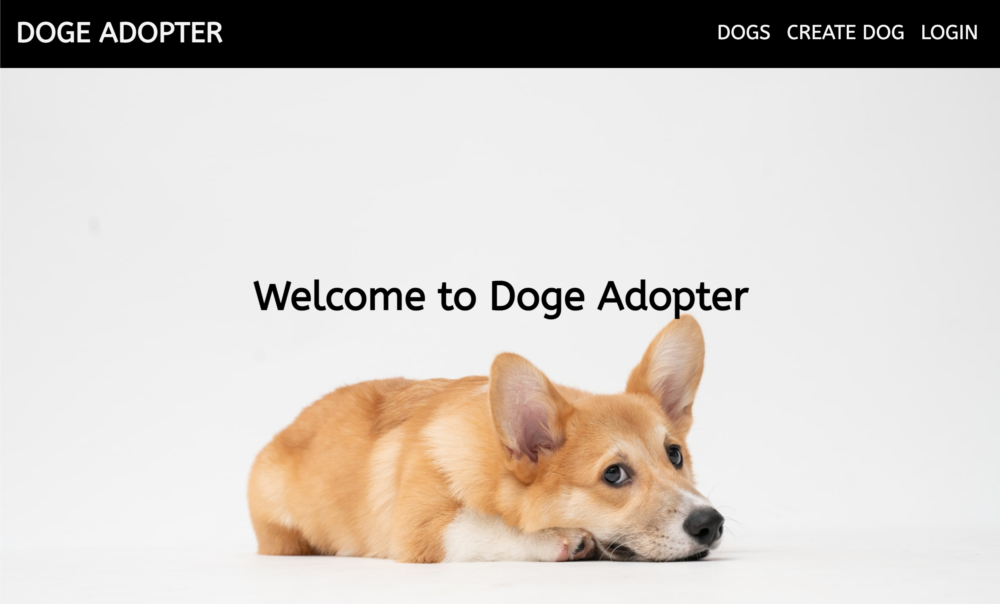
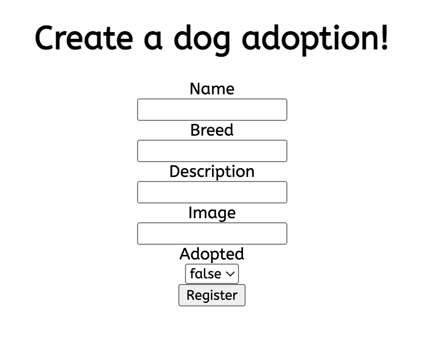

# AdoptADoge

Doge adopter is a small dog adoption website with full CRUD capabilities. 
**LIVE WEBSITE**: https://github.com/SunghunP/frontend-adopt-a-doge  
Client Repo: https://github.com/SunghunP/frontend-adopt-a-doge  
Server Repo: https://github.com/SunghunP/backend-adopt-a-doge  
Server App: https://adopt-a-doge.herokuapp.com/  

This project was generated with [Angular CLI](https://github.com/angular/angular-cli) version 14.1.2.

## Site Preview

> Landing Page: 
> Dogs Page: 
> Create Form Page:  

## Technologies Used

- Angular
- HTML
- SCSS
- Google Fonts
